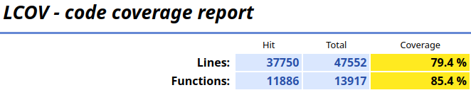

# Report for Assignment 1

## Project chosen

Name: `nix`

URL: https://github.com/NixOS/nix

Number of lines of code and the tool used to count it: 122773 lines.

Used shell command: `find . -name '*.cc' -or -name '*.hh' -or -name '*.hpp' -or -name '*.cpp' | xargs wc -l`

Programming language: `C++`

## Coverage measurement

### Existing tool

Tool used: [GCOV](https://gcc.gnu.org/onlinedocs/gcc/Gcov.html).

Command to run: `nix build .#hydraJobs.coverage`

### Your own coverage tool

#### Richard

`nix_get_external_value_content`

https://github.com/starkey60/nixSEP/commit/e9bd5c1b06bdb433e8b16f67430edf6e129edcdf

`toml::detail::parse_escape_sequence`

https://github.com/starkey60/nixSEP/commit/9686a73a527f5764752bbf19d2f552326d666ac8

#### Pijus

`toml::detail::parse_binary_integer`

https://github.com/starkey60/nixSEP/commit/dd296c09bff9ab5f030ba4a96764cd2a0fe01cfe

`toml::detail::parse_octal_integer`

https://github.com/starkey60/nixSEP/commit/be4e779f5a83561f8f2027ceaa59619de3523bb3

#### Matt

`toml::detail::parse_hexadecimal_integer`

https://github.com/starkey60/nixSEP/commit/9a892f1bca63d59a870e1fc15162a3eb5eb91ea2

`toml::detail::parse_integer`

https://github.com/starkey60/nixSEP/commit/58b20c1221cd0e08f4a06b642e779064d8d65b40

#### George

`toml::detail::parse_floating`

https://github.com/starkey60/nixSEP/commit/c0aeda47c207611491d06dd66381acb5e0550d3f

`toml::detail::parse_boolean`

https://github.com/starkey60/nixSEP/commit/185ff87079b77b4c068b8093ef307fdb58057a58

## Coverage improvement

### Individual tests

#### Rick

`nix_get_external_value_content`

https://github.com/starkey60/nixSEP/commit/e9bd5c1b06bdb433e8b16f67430edf6e129edcdf

Overall repository coverage did not improve by substancial amount (less than 0.1 percent). Improvement can also be seen by increase of covered lines. This is due to the size of the repository. The coverage still improved, because function `nix_get_external_value_content` is now covered, as seen by function coverage above.

`toml::detail::parse_escape_sequence`

https://github.com/starkey60/nixSEP/commit/9686a73a527f5764752bbf19d2f552326d666ac8

The overall codebase coverage improved by around 0.1 percents. This is due to the function `toml::detail::parse_escape_sequence` having full coverage, after implementing the tests. Function coverage can be seen above.

#### Pijus

`toml::detail::parse_binary_integer`

https://github.com/starkey60/nixSEP/commit/dd296c09bff9ab5f030ba4a96764cd2a0fe01cfe

The overall coverage improved by less than 0.1 percent. Improvement can also be seen by increase of covered lines. This is due to the size of the repository. Improvements were due to covering uncovered branch of function `toml::detail::parse_binary_integer`. The one uncovered branch that is left can never be reached (proven mathematically).

`toml::detail::parse_octal_integer`

https://github.com/starkey60/nixSEP/commit/be4e779f5a83561f8f2027ceaa59619de3523bb3

The overall coverage improved by 0.1 percent. This is due to fully covering `toml::detail::parse_octal_integer` function. 

#### Matt

`toml::detail::parse_hexadecimal_integer`

https://github.com/starkey60/nixSEP/commit/9a892f1bca63d59a870e1fc15162a3eb5eb91ea2

The overall coverage improved by less than 0.1 percent. Improvement can also be seen by increase of covered lines. This is due to the size of the repository. Improvements come from improving the coverage of function `toml::detail::parse_hexadecimal_integer`

`toml::detail::parse_integer`

https://github.com/starkey60/nixSEP/commit/58b20c1221cd0e08f4a06b642e779064d8d65b40

The overall coverage improved by less than 0.1 percent. Improvement can also be seen by increase of covered lines. This is due to the size of the repository. Improvements come from improving the coverage of function `toml::detail::parse_integer`.

#### George

`toml::detail::parse_floating`

https://github.com/starkey60/nixSEP/commit/c0aeda47c207611491d06dd66381acb5e0550d3f

The overall coverage improved by less than 0.1 percent. Improvement can also be seen by increase of covered lines. The improvements can be seen in the change of hit lines. This is due to improeved coverage of `toml::detail::parse_floating` function. The uncovered parts of the function can never be hit.

`toml::detail::parse_boolean`

https://github.com/starkey60/nixSEP/commit/185ff87079b77b4c068b8093ef307fdb58057a58

The overall coverage improved by less than 0.1 percent. Improvement can also be seen by increase of covered lines. This is due to the size of the repository. The uncovered part can never be hit.

### Overall

## Statement of individual contributions

#### Rick
Testing for functions `nix_get_external_value_content` and `toml::detail::parse_escape_sequence`.

Making of the homebrew instrumentation API.

Running coverages.

#### Pijus
Testing for functions `toml::detail::parse_binary_integer`and `toml::detail::parse_octal_integer`.

Making of the readme.

#### Matt
Testing for functions `toml::detail::parse_hexadecimal_integer` and `toml::detail::parse_integer`.

#### George
Testing for functions `toml::detail::parse_floating` and `toml::detail::parse_boolean`.
